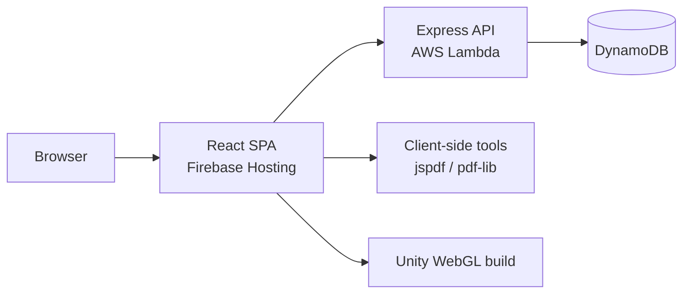

# Yehuda Shmulevitz — Portfolio Monorepo

Professional portfolio application with a React frontend, Express/AWS Lambda backend, bilingual UI (English/Hebrew), and integrated tools and games.

## Repository Structure

```
portfolio/
├── portfolio-frontend/   # React SPA (Firebase Hosting)
├── portfolio-backend/    # Express API (AWS Lambda + DynamoDB)
└── README.md             # This file
```

## Features

### Portfolio
- Hero section, featured projects, contact details
- English/Hebrew with RTL/LTR support
- Featured project: **Smart Employee Assistant** (Bedrock RAG IT support)

### Tools (client-side + API)
- JPG/PNG to PDF converter (per-image left rotation before export)
- PDF merge utility
- Developer Quiz (3 categories, practice + timed interview, admin dashboard, DynamoDB-backed)

### Admin Dashboard

Password-protected area at `/Admin` (navbar link). Three sections:

- **Manage Questions** — quiz question CRUD (same management as before, now under the dashboard)
- **Model Chat** — sample admin-only chat for testing AI interaction (OpenAI API, optional images, no persisted history; refresh clears the conversation). For testing/demo only.
- **AWS Costs** — read-only dashboard: month-to-date total, cost by service, daily trend chart (Cost Explorer; no billing write actions)

### Recent frontend improvements
- **Mobile responsive UI/UX** — improved spacing, touch targets, navigation menu, and layouts on small screens across portfolio, tools, quiz, and games (desktop layout unchanged).
- **JPG/PNG to PDF** — each selected image can be rotated left in 90° steps (unlimited) before PDF creation; rotation is applied in preview and in the exported PDF, fully client-side.

### Games
- Snake (global best score via API)
- Minesweeper
- Wizard Arena 3D (Unity WebGL)

## Architecture



| Layer | Technology |
|-------|------------|
| Frontend | React 18, React Router, i18next, CRA |
| Backend | Node.js, Express, serverless-http |
| Data | AWS DynamoDB |
| Hosting | Firebase Hosting (frontend), AWS Lambda (backend) |
| CI/CD | GitHub Actions → Lambda deploy |

## Prerequisites

- Node.js 18+ (frontend), Node.js 20+ recommended (backend/Lambda)
- npm
- AWS account with DynamoDB tables configured (for Quiz + Snake)
- Firebase CLI (for frontend deployment)

## Quick Start (Local)

### 1. Backend

```bash
cd portfolio-backend
cp .env.example .env
# Edit .env with your AWS region and table names
npm install
npm run dev
```

Backend runs at `http://localhost:5000`.

### 2. Frontend

```bash
cd portfolio-frontend
cp .env.example .env
# Set REACT_APP_API_BASE_URL=http://localhost:5000
npm install
npm start
```

Frontend runs at `http://localhost:3000` and proxies API calls in development.

## Environment Variables

### Frontend (`portfolio-frontend/.env`)

| Variable | Required | Description |
|----------|----------|-------------|
| `REACT_APP_API_BASE_URL` | Yes* | Backend base URL (*needed for Quiz/Snake) |

### Backend (`portfolio-backend/.env`)

| Variable | Required | Description |
|----------|----------|-------------|
| `PORT` | No | Local server port (default `5000`) |
| `ALLOWED_ORIGINS` | No | Comma-separated CORS origins |
| `AWS_REGION_DB` | Yes | DynamoDB region |
| `SNAKE_BEST_SCORE_TABLE` | Yes | Snake leaderboard table |
| `QUIZ_USER_STATS_TABLE` | Yes | Quiz user/session stats |
| `QUIZ_QUESTIONS_TABLE` | Yes | Quiz questions table |
| `QUIZ_ADMIN_PASSWORD` | Yes | Admin panel password (backend only) |
| `OPENAI_API_KEY` | For Model Chat | OpenAI API key (backend only) |
| `OPENAI_MODEL` | No | OpenAI model (default `gpt-4.1-mini`) |
| `AWS_REGION_CE` | No | Cost Explorer API region (default `us-east-1`) |

See `.env.example` files in each package for placeholders.

## AWS Resources

### DynamoDB Tables

**`snake_bestScore`**
- PK: `pk` (String) — value `snake`
- SK: `sk` (String) — value `global`
- Attribute: `bestScore` (Number)

**`quizQuestions`**
- PK: `questionId` (String)
- Categories: `oop`, `data_structures`, `algorithms` (20+ questions each, bilingual EN/HE)
- Attributes: `category`, `difficulty`, `isActive`, `questionText`, `answers`, `correctIndex`, `explanation`, `createdAt`, `updatedAt`
- GSI: `categoryDifficultyIndex` — PK `category`, SK `difficulty`

**`quizUserStats`**
- PK: `anonId` (String)
- Attributes: `sessionCurrent`, `historyScores`, `historyTimestamps`, `expiresAt`

### Quiz setup

```bash
cd portfolio-backend
npm run import:quiz:reset   # delete questions only, import 60-question dataset
```

**Modes:** Practice (unlimited, explanations on demand) · Interview (10 timed questions, summary at end)

**Admin:** Open `/Admin` in the frontend; password from `QUIZ_ADMIN_PASSWORD`. AWS Costs requires Cost Explorer access (`ce:GetCostAndUsage`) on the backend role.

**Docker:** From repo root: `docker compose up --build` (mounts AWS creds + loads `portfolio-backend/.env`).

## Build & Deploy

### Frontend

```bash
cd portfolio-frontend
npm run build
firebase deploy --only hosting
```

Set `REACT_APP_API_BASE_URL` to your production Lambda URL **before** building.

### Backend (Lambda)

Push to `main` on the backend repository triggers `.github/workflows/deploy-lambda.yml`.

Required GitHub configuration:
- Secret: `AWS_ROLE_ARN`
- Variables: `AWS_REGION`, `LAMBDA_FUNCTION_NAME`

### Docker (frontend only)

```bash
cd portfolio-frontend
docker compose up --build
```

Serves the production build at `http://localhost:3000`.

## Scripts

| Package | Command | Purpose |
|---------|---------|---------|
| frontend | `npm start` | Dev server |
| frontend | `npm run build` | Production build |
| frontend | `npm test` | Jest tests |
| backend | `npm run dev` | Dev server with nodemon |
| backend | `npm run check` | Syntax validation |
| backend | `npm run import:quiz` | Import quiz questions |
| backend | `npm run import:quiz:reset` | Reset + import quiz questions |

## Security Notes

- Never commit `.env` files or service account keys
- Restrict `ALLOWED_ORIGINS` in production
- Rotate credentials if they were ever exposed
- Quiz uses anonymous IDs — not suitable for authenticated user data

## Contact

- Email: yehuda.shmulevitz@gmail.com
- LinkedIn: [yehuda-shmulevitz](https://www.linkedin.com/in/yehuda-shmulevitz/)
- GitHub: [yehuda121](https://github.com/yehuda121)
