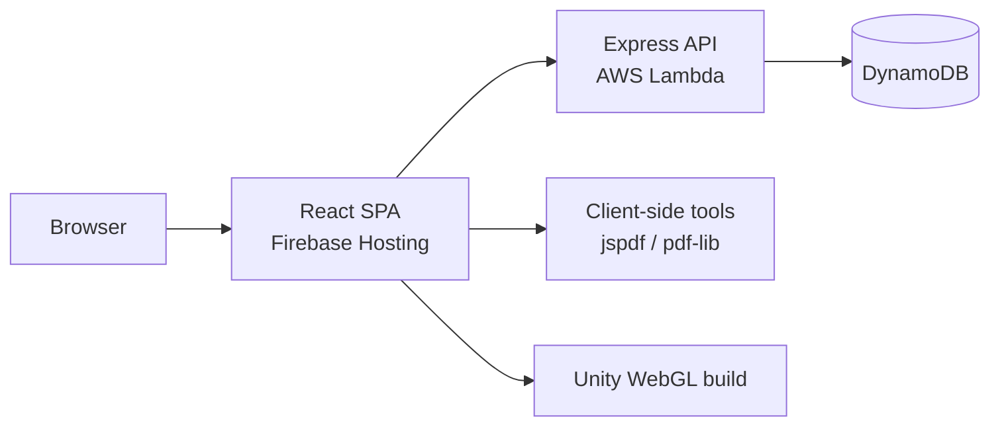

# Yehuda Shmulevitz — Portfolio

A full-stack professional portfolio with a bilingual React frontend, an Express API on AWS Lambda, client-side utilities, interactive games, and a DynamoDB-backed developer quiz system.

**Production:** [Firebase Hosting](https://firebase.google.com/docs/hosting) (frontend) · [AWS Lambda](https://aws.amazon.com/lambda/) (backend) · [Amazon DynamoDB](https://aws.amazon.com/dynamodb/) (data)


---

## Project overview

This repository is a **monorepo** containing everything needed to run, develop, and deploy the portfolio application:

| Package | Role | Production hosting |
|---------|------|--------------------|
| `portfolio-frontend/` | React single-page application | Firebase Hosting |
| `portfolio-backend/` | Express REST API (`serverless-http`) | AWS Lambda |

The site includes a personal portfolio, PDF tools, a developer quiz with an admin dashboard, and browser-based games. English and Hebrew are supported with RTL/LTR switching.

---

## Main features

### Portfolio
- Hero section, featured projects, and contact details
- B.Sc. degree page at `/degree` (language-specific diploma image)
- English / Hebrew UI with RTL/LTR support

### Tools
| Tool | Route | Notes |
|------|-------|-------|
| JPG/PNG to PDF | `/JpgToPdf` | Client-side; per-image rotation and reordering |
| PDF Merge | `/PdfMerge` | Client-side; reorder PDFs and pages, rotate individual pages |
| Developer Quiz | `/Quiz` | Practice and timed interview modes; DynamoDB-backed |

### Admin dashboard (`/Admin`)
Password-protected area with two sections:
- **Manage Questions** — bilingual quiz CRUD synced with DynamoDB
- **Model Chat** — admin-only OpenAI chat demo (no persisted history; for testing only)

### Games
| Game | Route | Backend |
|------|-------|---------|
| Snake | `/Snake` | Global best score via API |
| Minesweeper | `/Minesweeper` | Client-side only |
| Wizard Arena 3D | `/WizardArena3D` | Unity WebGL (browser) |

---

## Architecture



### Production architecture

```
GitHub (main branch)
        │
        ▼
.github/workflows/deploy-production.yml
        │
        ├── backend-check ──► syntax validation
        ├── frontend-check ─► tests + production build (REACT_APP_API_BASE_URL)
        │
        ├── deploy-backend ─► zip portfolio-backend → AWS Lambda (update-function-code)
        └── deploy-frontend ► Firebase Hosting (static build artifact)

Browser ──► Firebase Hosting (React SPA)
         └──► AWS Lambda Function URL / API Gateway (REST API)
                    └──► DynamoDB
```

Docker Compose in this repository is for **local development and testing only**. It does not replace Firebase Hosting or Lambda in production.

---

## Monorepo structure

```
portfolio/
├── .github/workflows/
│   └── deploy-production.yml    # Production CI/CD (single workflow)
├── docker-compose.yml           # Local full-stack Docker (not production)
├── docker-compose.env.example   # Optional compose env hints
├── questions/
│   └── questionsList.json       # Canonical quiz import dataset (60 questions)
├── portfolio-frontend/
│   ├── public/                  # Static assets, Unity WebGL, diplomas
│   ├── src/                     # React application
│   ├── firebase.json            # Firebase Hosting config
│   ├── Dockerfile               # Local container build (nginx)
│   └── .env.example
├── portfolio-backend/
│   ├── src/
│   │   ├── app.js               # Express application
│   │   ├── lambda.js            # Lambda handler
│   │   ├── routes/              # Snake, Quiz, Admin APIs
│   │   └── scripts/             # Quiz import utility
│   ├── Dockerfile               # Local API container
│   └── .env.example
└── README.md                    # This file
```

---

## Technologies

| Layer | Stack |
|-------|-------|
| Frontend | React 18, React Router 6, i18next, Create React App |
| PDF tools | jspdf, pdf-lib (client-side) |
| Backend | Node.js, Express, serverless-http |
| Cloud | Firebase Hosting, AWS Lambda, DynamoDB |
| AI (admin demo) | OpenAI API |
| CI/CD | GitHub Actions |
| Local containers | Docker Compose, nginx |

---

## Frontend

The frontend is a React SPA with lazy-loaded routes, a custom UI layer (toasts, modals, error boundaries), and bilingual i18n files under `portfolio-frontend/src/i18n/`.

**Key paths:**
- `src/App.js` — routing
- `src/api/client.js` — API client (`REACT_APP_API_BASE_URL`)
- `src/portfolio/` — pages, tools, games, admin

**Production build:** `npm run build` outputs to `portfolio-frontend/build/`, which Firebase Hosting serves per `firebase.json`.

---

## Backend

The backend is an Express application wrapped for Lambda via `src/lambda.js`. It exposes REST endpoints for Snake, Quiz sessions, and admin operations. Question content is stored in DynamoDB; UI strings remain in frontend i18n files.

**Key paths:**
- `src/app.js` — middleware, routes, health check
- `src/routes/quiz/` — session, questions, admin, character chat
- `src/routes/snake/` — global leaderboard
- `src/scripts/importQuizQuestions.js` — import utility

The CI/CD pipeline deploys **function code only** (`update-function-code`). Runtime environment variables must be configured separately in the AWS Lambda console (see below).

---

## Local development

### Prerequisites

- Node.js 18+ (frontend); Node.js 20+ recommended (backend / Lambda parity)
- npm
- AWS account with DynamoDB tables (for Quiz and Snake)
- Firebase CLI (optional — for manual frontend deploys only)

### Native local setup

**1. Backend**

```bash
cd portfolio-backend
cp .env.example .env
# Edit .env — see Environment variables below
npm install
npm run dev
```

API available at `http://localhost:5000`.

**2. Frontend**

```bash
cd portfolio-frontend
cp .env.example .env
# Set REACT_APP_API_BASE_URL=http://localhost:5000
npm install
npm start
```

App available at `http://localhost:3000`. The `proxy` field in `package.json` also forwards unknown requests to the backend during development.

### Docker local setup

From the **repository root**:

```bash
# Ensure portfolio-backend/.env exists (copy from .env.example)
docker compose up --build
```

| Service | URL |
|---------|-----|
| Frontend (nginx) | http://localhost:3000 |
| Backend API | http://localhost:5000 |

Docker builds a production-like frontend image with `REACT_APP_API_BASE_URL=http://localhost:5000`. The backend container loads `portfolio-backend/.env` and mounts the host AWS credentials directory for DynamoDB access.

On Windows, `docker-compose.yml` mounts `%USERPROFILE%\.aws`. On Linux or macOS, set `AWS_ACCESS_KEY_ID` and `AWS_SECRET_ACCESS_KEY` in `portfolio-backend/.env` if the mount path is unavailable.

See `docker-compose.env.example` for optional table-name overrides.

---

## Environment variables

### How `.env.example` files work

Each package includes a tracked `.env.example` with **placeholders only**. Copy to `.env` locally:

```bash
cp portfolio-frontend/.env.example portfolio-frontend/.env
cp portfolio-backend/.env.example portfolio-backend/.env
```

Never commit `.env` files. They are listed in `.gitignore`.

### Frontend (`portfolio-frontend/.env`)

| Variable | Required | Description |
|----------|----------|-------------|
| `REACT_APP_API_BASE_URL` | Yes* | Backend base URL, no trailing slash (*required for Quiz and Snake) |

### Backend — local development (`portfolio-backend/.env`)

| Variable | Required | Description |
|----------|----------|-------------|
| `PORT` | No | Server port (default `5000`) |
| `ALLOWED_ORIGINS` | No | Comma-separated CORS origins |
| `AWS_REGION_DB` | Yes | DynamoDB region |
| `SNAKE_BEST_SCORE_TABLE` | Yes | Snake leaderboard table name |
| `QUIZ_USER_STATS_TABLE` | Yes | Quiz session / stats table |
| `QUIZ_QUESTIONS_TABLE` | Yes | Quiz questions table |
| `QUIZ_ADMIN_PASSWORD` | Yes | Admin dashboard password (backend only) |
| `OPENAI_API_KEY` | For Model Chat | OpenAI API key |
| `OPENAI_MODEL` | No | OpenAI model (default `gpt-4.1-mini`) |
| `AWS_ACCESS_KEY_ID` | For local AWS | Optional if using `~/.aws` profile |
| `AWS_SECRET_ACCESS_KEY` | For local AWS | Optional if using `~/.aws` profile |
| `AWS_SESSION_TOKEN` | No | Optional temporary session token |

### Lambda runtime environment variables

Configure these in the **AWS Lambda console** (or infrastructure-as-code). The GitHub Actions workflow updates function **code** only; it does not set these values.

| Variable | Required | Description |
|----------|----------|-------------|
| `ALLOWED_ORIGINS` | Yes | Production frontend origin(s), comma-separated |
| `AWS_REGION_DB` | Yes | DynamoDB region |
| `SNAKE_BEST_SCORE_TABLE` | Yes | Snake table name |
| `QUIZ_USER_STATS_TABLE` | Yes | Quiz stats table name |
| `QUIZ_QUESTIONS_TABLE` | Yes | Quiz questions table name |
| `QUIZ_ADMIN_PASSWORD` | Yes | Admin password |
| `OPENAI_API_KEY` | For Model Chat | OpenAI API key |
| `OPENAI_MODEL` | No | OpenAI model override |

Lambda uses the execution role for DynamoDB access; local `AWS_ACCESS_KEY_ID` variables are not needed in production.

---

## DynamoDB

### `snake_bestScore`
- **PK:** `pk` (String) — value `snake`
- **SK:** `sk` (String) — value `global`
- **Attribute:** `bestScore` (Number)

### `quizQuestions`
- **PK:** `questionId` (String)
- **Categories:** `oop`, `data_structures`, `algorithms` (20 questions each, bilingual EN/HE)
- **GSI:** `categoryDifficultyIndex` — PK `category`, SK `difficulty`

### `quizUserStats`
- **PK:** `anonId` (String)
- **Attributes:** `sessionCurrent`, `historyScores`, `historyTimestamps`, `expiresAt`

---

## Quiz data import

Import the canonical 60-question dataset from the repository root:

```bash
cd portfolio-backend
npm run import:questions
```

This runs `importQuizQuestions.js` against `questions/questionsList.json`. Ensure `AWS_REGION_DB`, `QUIZ_QUESTIONS_TABLE`, and valid AWS credentials are configured before importing.

**Quiz modes:** Practice (unlimited, explanations on demand) · Interview (10 timed questions, summary at end)

**Admin access:** Open `/Admin` in the frontend; authenticate with `QUIZ_ADMIN_PASSWORD`.

---

## GitHub Actions CI/CD

**Workflow:** `.github/workflows/deploy-production.yml`

**Triggers:** push to `main`, or manual `workflow_dispatch`

**Pipeline:**

1. **backend-check** — `npm ci`, `npm run check`
2. **frontend-check** — `npm ci`, `npm test`, production `npm run build`
3. **deploy-backend** — package and deploy Lambda function code (OIDC)
4. **deploy-frontend** — deploy build artifact to Firebase Hosting
5. **notify** — optional email on success or failure (SMTP secrets)

Deployments run only after both check jobs succeed.

### Required GitHub Secrets

| Secret | Purpose |
|--------|---------|
| `AWS_ROLE_ARN` | OIDC role for Lambda deployment |
| `FIREBASE_SERVICE_ACCOUNT_JSON` | Firebase service account JSON for Hosting deploy |
| `REACT_APP_API_BASE_URL` | Production API URL baked into the frontend build |

### Optional GitHub Secrets (email notifications)

| Secret | Purpose |
|--------|---------|
| `SMTP_SERVER` | SMTP host |
| `SMTP_PORT` | SMTP port |
| `SMTP_USERNAME` | SMTP username |
| `SMTP_PASSWORD` | SMTP password |
| `SMTP_FROM` | Sender address |
| `DEPLOY_NOTIFY_EMAIL` | Recipient for deploy notifications |

If any SMTP secret is missing, the notification job skips email gracefully.

### Required GitHub Variables

| Variable | Purpose |
|----------|---------|
| `AWS_REGION` | AWS region for Lambda deploy |
| `LAMBDA_FUNCTION_NAME` | Target Lambda function name |
| `FIREBASE_PROJECT_ID` | Firebase project ID for Hosting deploy |

### Manual deployment (secondary)

**Frontend** — requires Firebase CLI and a local production build:

```bash
cd portfolio-frontend
# Set REACT_APP_API_BASE_URL to your production Lambda URL before building
npm run build
firebase deploy --only hosting
```

**Backend** — production deploys are intended via CI. Manual Lambda updates are possible but not documented here as the primary path.

---

## API overview

### Health
- `GET /health`

### Snake (`/api/snake`)
- `GET /api/snake/best-score`
- `POST /api/snake/submit-score` — body: `{ "score": number }`

### Quiz (`/api/quiz`)

**Session** (header: `x-anon-id`)
- `POST /api/quiz/session/start`
- `POST /api/quiz/session/answer`
- `POST /api/quiz/session/explanation`
- `GET /api/quiz/session/current`
- `GET /api/quiz/session/summary`

**Questions**
- `GET /api/quiz/questions/next?lang=en|he` — never returns `correctIndex` before submission

**Admin** (header: `x-quiz-admin-token`)
- `POST /api/quiz/admin/login` · `POST /api/quiz/admin/logout` · `GET /api/quiz/admin/me`
- `GET|POST /api/quiz/admin/questions` · `PUT|DELETE /api/quiz/admin/questions/:id`
- `PATCH /api/quiz/admin/questions/:id/toggle-active`
- `POST /api/quiz/admin/character-chat` — Model Chat (requires `OPENAI_API_KEY`)

---

## NPM scripts

| Location | Command | Purpose |
|----------|---------|---------|
| `portfolio-frontend` | `npm start` | Development server (port 3000) |
| `portfolio-frontend` | `npm run build` | Production build |
| `portfolio-frontend` | `npm test` | Jest tests |
| `portfolio-backend` | `npm run dev` | Dev server with nodemon |
| `portfolio-backend` | `npm start` | Production server locally |
| `portfolio-backend` | `npm run check` | Syntax validation |
| `portfolio-backend` | `npm run import:questions` | Import quiz JSON to DynamoDB |

---

## Security best practices

- Treat `.env` files, API keys, and service account JSON as secrets. Use `.env.example` templates for documentation only.
- Store production credentials in GitHub Actions secrets and AWS Lambda environment configuration — not in source code.
- Restrict `ALLOWED_ORIGINS` in production to your Firebase Hosting domain(s).
- Rotate any credential that may have been exposed or committed accidentally.
- The quiz uses anonymous session IDs (`x-anon-id`); it is not designed for authenticated user accounts.
- Admin authentication uses a server-side password and HMAC token suitable for this portfolio context; do not reuse production passwords elsewhere.

---

## Troubleshooting

| Issue | Likely cause | What to check |
|-------|--------------|---------------|
| Quiz or Snake API errors locally | Backend not running or wrong API URL | `REACT_APP_API_BASE_URL`, backend on port 5000 |
| DynamoDB / credentials errors | Missing AWS config | `portfolio-backend/.env`, `~/.aws` profile, or Docker env vars |
| CORS errors in production | Origin not allowed | `ALLOWED_ORIGINS` in Lambda environment |
| Docker Quiz fails on Linux/macOS | Windows-specific AWS mount | Set `AWS_ACCESS_KEY_ID` / `AWS_SECRET_ACCESS_KEY` in `.env` |
| Empty quiz after setup | Questions not imported | Run `npm run import:questions` |
| Model Chat unavailable | Missing OpenAI key | `OPENAI_API_KEY` in backend `.env` or Lambda |
| CI frontend build wrong API | Secret not set | `REACT_APP_API_BASE_URL` GitHub secret |
| Firebase deploy fails in CI | Service account or project | `FIREBASE_SERVICE_ACCOUNT_JSON`, `FIREBASE_PROJECT_ID` |

---

## Contact

- **Email:** yehuda.shmulevitz@gmail.com
- **LinkedIn:** [yehuda-shmulevitz](https://www.linkedin.com/in/yehuda-shmulevitz/)
- **GitHub:** [yehuda121](https://github.com/yehuda121)
